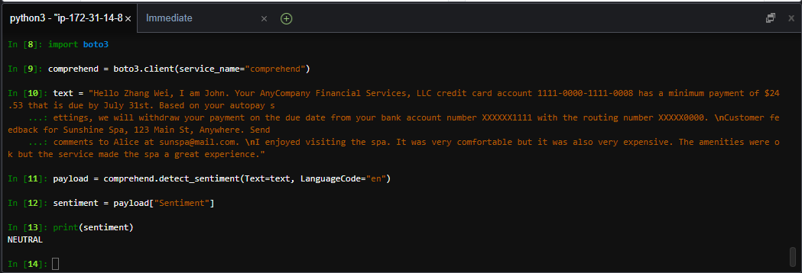
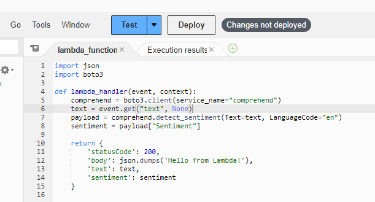
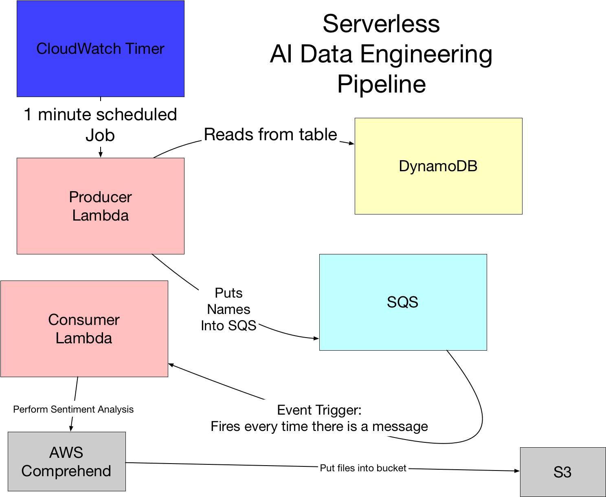
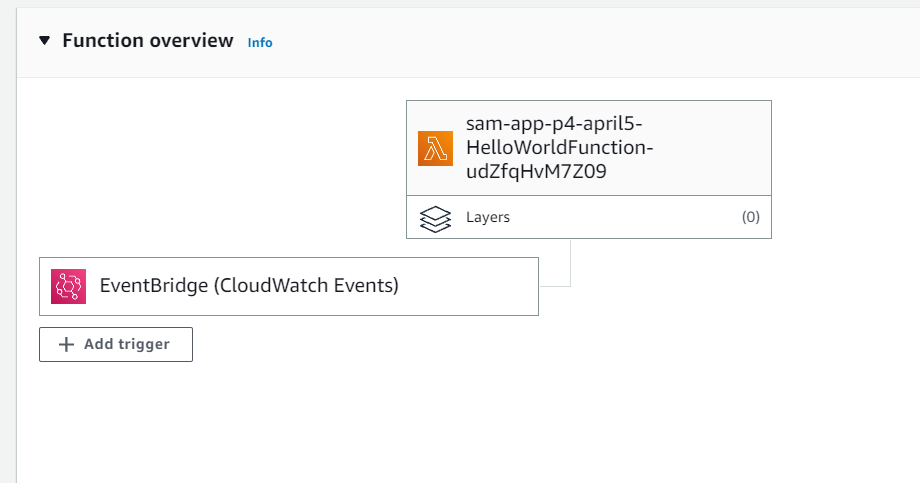
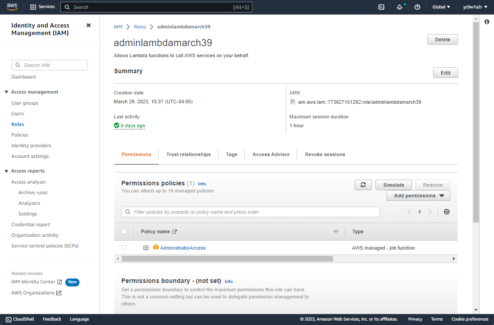
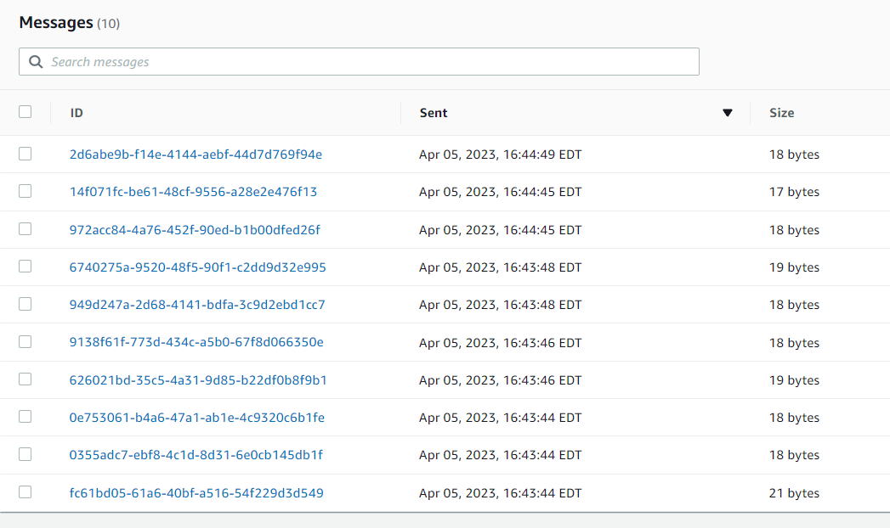
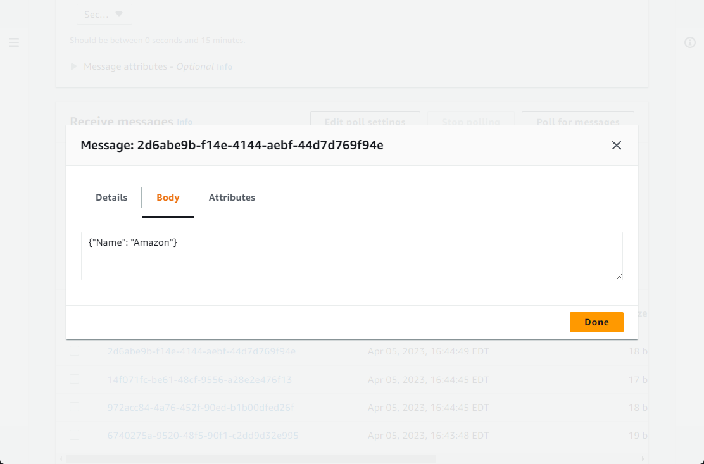
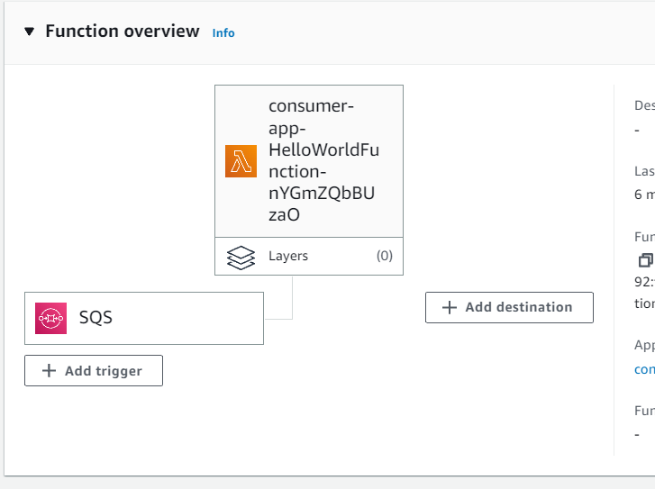
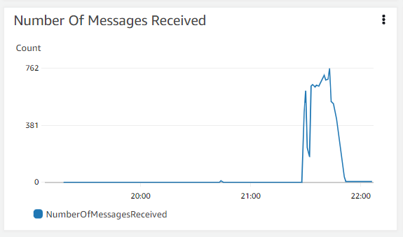
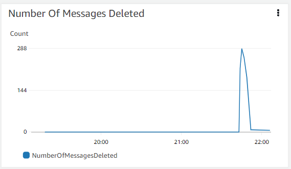

<!-- [](https://github.com/nogibjj/python-template/actions/workflows/cicd.yml) -->

# Project4
## Serverless Data Engineering Pipeline

### Goals
 - [x] Reproduce the architecture of the example serverless data engineering project or perform something similar using only serverless technologies
 - [ ] Enhance the project by extending the functionality of the NLP analysis: adding entity extraction, key phrase extraction, or some other NLP feature or doing Applied Computer Vision.

### Week 9: Calling Amazon Comprehend service inside AWS Cloud9




### Week 10: Create serverless pipeline



1. Initiate, Build, and Deploy SAM application. 
```
sam init
sam build --use-container
sam deploy --guided
```
Before build and deploy, change app.py with the code provided in 
* [tutorial/populate_sqs.py](https://github.com/noahgift/awslambda/blob/master/example_src/populate_sqs.py)

Also remember to update requirements.txt to have the packages configured

And create CloudWatch Events Trigger


2. Modify the Execution Role at this newly created lambda function: Configuration -> Edit Execution role -> choose the role with AdministratorAccess you created before


3. Check SQS to see if have messages received



4. Follow same process, create a consumer SAM application
```
sam init
```
Before build and deploy, change app.py with the code provided in 
* [tutorial/serverless_sentiment_lambda.py](https://github.com/noahgift/awslambda/blob/master/example_src/serverless_sentiment_lambda.py)

Since the consumer application depends on several third party packages, we need to install the packages at the directory above `app.py before we build and deploy it.
```
cd consumer-sam-app-p4-april5/hello_world
python -m venv ../venv
source ../venv/bin/activate
pip install -r requirements.txt 
```

Then deploy and build:
```
sam build --use-container
sam deploy --guided
```

And create SQS Trigger


And you can observe the drop of the number of messages received in the SQS monitor.



To see the sentiment analysis ongoing, go CloudWatch Logs inside our consumer function

Use CloudWatch LogInsights to find the sentiment results
```
fields @message
| sort @timestamp desc
| limit 50 | filter @message like /Sentiment from FANG companies/
```

```
Field	Value
@ingestionTime	
1680732228449
@log	
773627151292:/aws/lambda/consumer-app-HelloWorldFunction-nYGmZQbBUzaO
@logStream	
2023/04/05/[$LATEST]3802ebd018fd42f089615ec52c5523bd
@message	
{"message": "Sentiment from FANG companies: {'names': {0: 'Microsoft'}, 'wikipedia_snippit': {0: 'Microsoft Corporation is an American multinational technology corporation headquartered in Redmond, Washington.'}, 'Sentiment': {0: 'NEUTRAL'}}", "aws_request_id": "cb71ec28-7146-5474-b655-b08f833877d2"}
@timestamp	
1680732228172
aws_request_id	
cb71ec28-7146-5474-b655-b08f833877d2
message	
Sentiment from FANG companies: {'names': {0: 'Microsoft'}, 'wikipedia_snippit': {0: 'Microsoft Corporation is an American multinational technology corporation headquartered in Redmond, Washington.'}, 'Sentiment': {0: 'NEUTRAL'}}
```

### Week 11: Modify the pipeline to fit other NLP tasks

## Reference
* [tutorial](https://github.com/noahgift/awslambda)
* [python template](https://github.com/nogibjj/python-template)
* [Amazon Comprehend](https://docs.aws.amazon.com/comprehend/latest/dg/what-is.html)